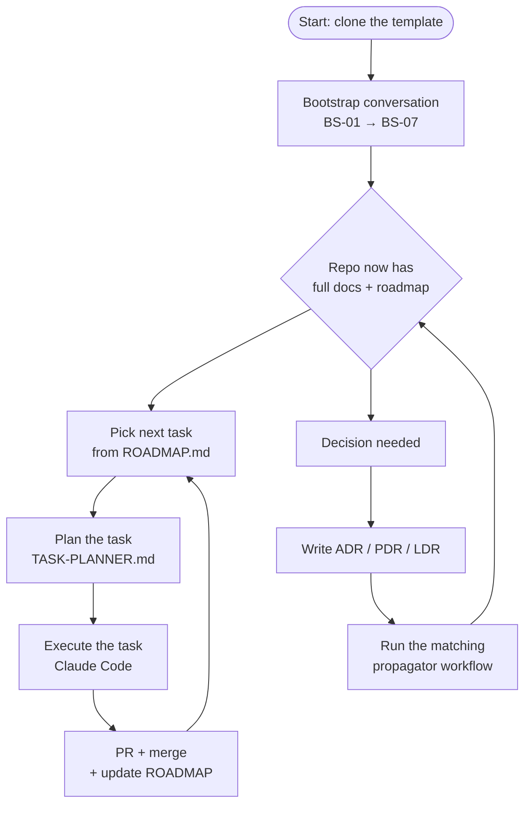

# ai-engineering-0-to-1

A starter kit for building software with AI deliberately — not by improvisation.

[](LICENSE)

> Two posts explain the method behind this kit:
> 1. [The method, in plain terms](<!-- TODO: link to Post 1 -->) — why a structured workflow beats freestyle prompting.
> 2. [The bootstrap, step by step](<!-- TODO: link to Post 2 -->) — what each step produces and why the order matters.

---

## At a glance

Clone the repo, run a guided bootstrap conversation, and you get a project with:

- A complete documentation skeleton (product, architecture, conventions, security, roadmap, decision records)
- A Planner / Executor workflow that splits the conversation about *what to build* from the act of *building it*
- An LLM that has been told, in advance, what it's allowed to assume and what it must ask about

It is opinionated about reproducibility, traceability, and the friction-points that show up in real AI-assisted work.

The template was designed for **building new backend systems from scratch, fully AI-assisted from day one**. The structure can be adapted to other contexts (frontends, CLIs, data pipelines, existing codebases) but those weren't the primary design target.

---

## Why this exists

LLMs are great at the next token. They are mediocre at the next decision when the previous decisions weren't written down.

Most AI-assisted coding sessions go through the same erosion: the first hour is brilliant, the second hour repeats earlier mistakes, the third hour invents a new pattern that contradicts the first one. The tool didn't get worse — context got thinner.

This kit fixes the context. It gives the LLM (and the human) a place to put every decision before it gets made, and a workflow that makes consulting those decisions the path of least resistance.

It does not promise faster shipping. It promises that what ships matches what you intended.

---

## How it flows

The template has one entry path (bootstrap), one continuous loop (per-task development), and one supporting loop (decisions that ripple across docs).



- The **bootstrap** runs once, end-to-end, in a single guided conversation. It produces the docs and the roadmap.
- The **task loop** is where most of the work happens after the bootstrap. Each task is planned, executed, and merged. The roadmap stays current as you go.
- The **decision loop** runs whenever a non-trivial choice surfaces. Writing the decision record (ADR for technical, PDR for product, LDR for legal) and running the propagator is what keeps the docs honest as the project evolves.

---

## Quick start

### Option 1 — Create a new project from this template (recommended)

GitHub lets you create a new repository directly from a template repo. On [the repo page](https://github.com/bernardosborges/ai-engineering-0-to-1), click the green **Use this template** button at the top right and choose **Create a new repository**. GitHub copies the files into a fresh repo under your account, with no history attached. Clone it locally and you're ready.

### Option 2 — Clone and reset

```bash
git clone https://github.com/bernardosborges/ai-engineering-0-to-1.git my-new-project
cd my-new-project
rm -rf .git
git init
git add .
git commit -m "chore: scaffold from ai-engineering-0-to-1"
```

### Then run the bootstrap

The bootstrap is a guided conversation that runs in **Claude Desktop with the filesystem MCP server enabled**, so the LLM can read your project files and apply edits as the conversation progresses. The web version of claude.ai can't access local files and won't work for this flow.

If you haven't set up the filesystem MCP yet, follow [Anthropic's MCP filesystem guide](https://modelcontextprotocol.io/quickstart/user) and point it at the project folder you just cloned. Then start a new chat in Claude Desktop and send:

```
@.ai/workflows/BOOTSTRAPPER.md

Let's start the bootstrap.
```

The conversation walks you through 7 steps (BS-01 to BS-07), filling the documentation as you go. Plan for one or two sessions of focused work. The bootstrap is the only part of this method that runs end-to-end in a single chat — every step after that is short, focused, and reuses the artifacts the bootstrap produced.

When BS-07 closes, your repo has a complete roadmap and the first task is ready to be planned. From that point on, every change goes through the normal Planner → Executor flow.

---

## What you get

### A documentation skeleton that LLMs can navigate

```
docs/
├── INDEX.md                  Map of every doc, by area, by task, by topic
├── PRODUCT.md                What the product is + per-feature docs
├── ENGINEERING.md            Entry point to engineering decisions
├── ROADMAP.md                Phased plan + retrospectives
├── LEGAL.md                  Compliance and policy considerations
├── engineering/
│   ├── ARCHITECTURE.md       Components, flows, cross-cutting decisions
│   ├── STRUCTURE.md          Folder layout
│   ├── TECH_STACK.md         Pinned tools with rationale
│   ├── CODE_STYLE.md         How to write code in this project
│   ├── TESTING.md            Pyramid, markers, coverage targets
│   ├── SECURITY.md           Auth, secrets, AI-specific risks
│   ├── GIT.md                Branching, commits, PR conventions
│   ├── LANGUAGE.md           Language policy
│   ├── TECH_DEBT.md          Register of deferred decisions
│   └── adr/                  Architecture Decision Records
├── product/
│   ├── pd-*.md               Product discovery docs (one per dimension)
│   ├── ft-*.md               Per-feature docs
│   └── pdr/                  Product Decision Records
└── legal/
    ├── POLICY_CONSIDERATIONS.md
    └── ldr/                  Legal Decision Records
```

Every doc has a purpose. Every cross-reference is checked by a validator workflow. Decision records (ADRs, PDRs, LDRs) propagate changes across affected docs automatically.

### A set of LLM workflows for each role

```
.ai/workflows/
├── BOOTSTRAPPER.md           Bootstrap conversation manual
├── bootstrap/                Step-by-step instructions BS-01..BS-07
├── TASK-PLANNER.md           Per-task planning conversation
├── ROADMAP-PLANNER.md        Structural roadmap changes
├── ROADMAP-EDITOR.md         Applies a roadmap planning prompt
├── ADR-PROPAGATOR.md         Propagates an accepted ADR
├── PDR-PROPAGATOR.md         Propagates an accepted PDR
├── LDR-PROPAGATOR.md         Propagates an accepted LDR
└── DOCS-VALIDATOR.md         Validates and fixes doc cross-references
```

Each workflow is a complete operating manual for one role an LLM plays in the method. Humans invoke a workflow at the start of a conversation; the LLM reads the manual and stays in role.

### A Planner / Executor split

**Planner** — runs in Claude's desktop app. Reads docs, asks targeted questions, produces a structured prompt file for each task. Has continuous context across the planning. Never writes code.

**Executor** — runs in Claude Code CLI in a fresh session. Reads the prompt file, implements, tests, commits. Starts each task with a clean context window.

Between them, the engineer makes the decisions that matter.

---

## How the method handles change

Three kinds of decisions get their own durable record + propagation workflow:

- **ADR** (Architecture Decision Record) — for technical decisions. After accepting an ADR, run `@.ai/workflows/ADR-PROPAGATOR.md` to update every affected engineering doc.
- **PDR** (Product Decision Record) — for product decisions. After accepting a PDR, run `@.ai/workflows/PDR-PROPAGATOR.md` to update every affected product doc (and create new feature docs if the decision introduces them).
- **LDR** (Legal Decision Record) — for legal positions. After accepting an LDR, run `@.ai/workflows/LDR-PROPAGATOR.md` to update every affected policy doc.

For roadmap changes (decomposing a task, inserting a new one, creating a new phase), there's `ROADMAP-PLANNER.md` → `ROADMAP-EDITOR.md`. For periodic documentation health, `DOCS-VALIDATOR.md`.

Nothing in `docs/` should be edited manually when a decision is the reason for the edit. The propagators are the path.

---

## How the template uses markers

Two kinds of markers appear in the template files:

**BOOTSTRAP markers** (visible blockquote with 📝) — sections waiting for content from the bootstrap workflow. Each marker names the bootstrap step that fills it. After the content is written, the marker block is replaced by the content. Markers also exist for runtime additions (e.g., new ADRs accepted later in the project).

**`PYTHON_REFERENCE_EXAMPLE` blocks** (invisible HTML comments) — Python-specific examples for sections where idiomatic detail matters. Invisible in the GitHub render, visible to the LLM reading the raw markdown. The bootstrap workflow translates these to your actual stack and removes the blocks at the end. If you use Python, much of the content carries over directly; if you use another stack, the bootstrap rewrites with the appropriate idiom.

---

## What this is not

- **Not a framework.** Markdown templates and workflows. No code runs here.
- **Not a tutorial for LLM tools.** It assumes basic familiarity with AI-assisted coding.
- **Not stack-locked.** The reference examples are Python, but the bootstrap adapts to any backend stack — Node, Go, Rust, etc. The structure of the docs and the workflow stays the same; only the concrete tool names change.
- **Not for retrofitting existing codebases.** The bootstrap assumes a fresh start. Applying it to a repo that already has code, conventions, and product context will fight you more than help.
- **Not a finished product.** It's the snapshot of a workflow being actively used. Expect changes.

---

## Repository structure

```
.
├── CLAUDE.md                 Universal project rules read by LLMs every session
├── README.md                 You are here
├── LICENSE                   MIT
├── .github/
│   └── PULL_REQUEST_TEMPLATE.md
├── app/                      Where your code lives (empty in the template)
├── docs/                     Project documentation
│   └── …                     See "What you get" above
└── .ai/                      AI-assisted development workflows
    ├── INDEX.md              Map of every workflow and prompt type
    ├── workflows/            Operating manuals for each LLM role
    └── prompts/              Generated prompts (one per task / planning event)
        ├── execution/
        ├── planning/
        └── TEMPLATE.md
```

Two top-level folders, two purposes:

- **`docs/`** is project knowledge. The kind of documentation that exists whether or not AI is in the loop. Both humans and AI consult it.
- **`.ai/`** is the methodology layer. Workflows, prompts, templates. Remove AI from the project and `.ai/` becomes obsolete; `docs/` stays useful.

---

## Status and feedback

This template emerged from a real backend project built fully AI-assisted from day one. It is shared as is, with no promise of maintenance, but issues, discussions, and pull requests are welcome.

If you adopt it (or adapt it to a different kind of application), I'd be curious to hear what changed. Open an issue or reach out.

---

## License

MIT. See [LICENSE](LICENSE).

---

## About

Created by [Bernardo Serpa Borges](https://www.linkedin.com/in/beniborges/), a Founding Engineer working on AI-assisted backend development.
